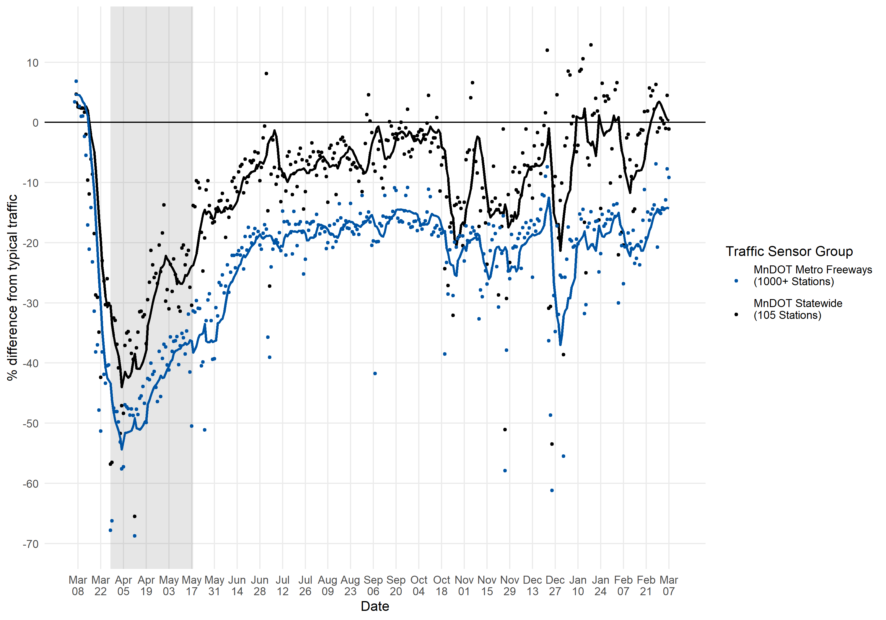

**This app is in active development and will be updated frequently.
Thank you for your patience.**

## About

A Metropolitan Council analysis of over 1,000 freeway traffic monitoring
stations across the metropolitan area and beyond show that Minnesotans
are doing their part to limit the spread of COVID-19 by reducing travel
and staying home.

Researchers at the Metropolitan Council are using traffic data from the
Minnesota Department of Transportation (MnDOT) to evaluate the impact of
recent physical distancing efforts on regional and statewide travel.
Using a modeling approach that relies on historical traffic data to
estimate typical travel, Met Council researchers have shown that travel
across the region’s freeways has declined by more than 70% in the weeks
following the first COVID-19 case in Minnesota, on March 6th.

### State actions appear in travel data

Travel decreased over time as state officials took action to support
physical distancing efforts. For example, after the Governor asked
Minnesotans to cancel all large gatherings and limit restaurants to
takeout on March 18, travel decreased by an additional 7% over what had
already been a 35% decrease from typical. Travel increased slightly on
Friday, March 20, perhaps in anticipation of additional statewide travel
restrictions.

These data are helping inform statewide models of disease transmission,
and helping policymakers evaluate the impact of their actions on
physical distancing efforts.

Researchers at the Met Council will continue to update these figures as
additional restrictions go into effect, and as restrictions are lifted.
Future research at the Council aims to understand the impact of physical
distancing efforts on other types of travel, especially pedestrian and
bike travel. Researchers also hope to study other aspects of travel
behavior – including the travel that Minnesotans do in service to others
in their household, family or community.

### Data sources

Traffic are provided by MnDOT. We pull these data using our open-source
R package,
[tc.sensors](https://github.com/Metropolitan-Council/tc.sensors).

### Modeling

To estimate typical traffic in a way that is robust to Minnesota’s
famous fluctuations in weather, we used a statistical modeling approach
that relies on three years of data (2018, 2019, and 2020 up to March 1,
2020). The model used here is a generalized additive model, or GAM. GAMs
are commonly used in analyses of data with a strong seasonal or cyclical
trend – especially when that trend does not follow a perfectly straight
line. Some GAMs that people might already be familiar with are those
that meteorologists and climatologists use to estimate temperature
trends within and across years.

Our GAMs consider two trends. One trend happens over the span of a year:
in most places, travel increases in the summer months and decreases in
the winter months. A second trend occurs over the span of a week: travel
tends to be highest on Fridays, and lowest on Sundays. To allow the
shapes of these yearly and weekly trends to vary in a location-specific
way, we created separate models for each traffic monitoring station.

### Resources

[Minnestota COVID-19 Response and
Preparation](https://mn.gov/governor/covid-19/)  
[Minnestoa Department of Health COVID-19
site](https://www.health.state.mn.us/diseases/coronavirus/index.html)

### Contributors

  - Liz Roten, app development (Metropolitan Council)  
  - Ashley Asmus, data and model development (Metropolitan Council)  
  - Brian Kary, data development and ongoing consultation (MnDOT)  
  - Jonathan Ehrlich, project management (Metropolitan Council)

### Contact

Email Sara Maaske at <Sara.Maaske@metc.state.mn.us>.

For app bug reports and new feature requests, feel free to open an Issue
on our [GitHub
repository](https://github.com/Metropolitan-Council/loop-sensor-trends)
for this project.

<right style="font-size: 1rem; text-align: right; display: block;">
*Last updated 2020-04-20*  
Build ID: 2020-04-20.roten.a544e2e  
</right>
